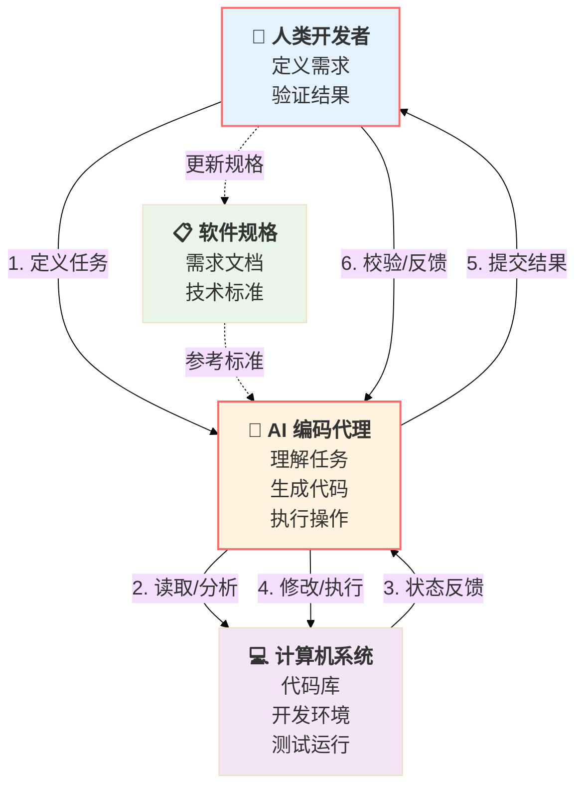

# 人在回路（Human-in-the-loop）

关注任务定义与结果校验，降低幻觉与偏差。

```mermaid {scale: 0.5}
%%{init: {'theme':'base', 'themeVariables': {'fontSize':'20px'}}}%%
graph TB
    Human["<b>👤 人类开发者</b><br/>定义需求<br/>验证结果"]
    Spec["<b>📋 软件规格</b><br/>需求文档<br/>技术标准"]
    Agent["<b>🤖 AI 编码代理</b><br/>理解任务<br/>生成代码<br/>执行操作"]
    System["<b>💻 计算机系统</b><br/>代码库<br/>开发环境<br/>测试运行"]

    Human -->|"1. 定义任务"| Agent
    Spec -.->|"参考标准"| Agent
    Agent -->|"2. 读取/分析"| System
    System -->|"3. 状态反馈"| Agent
    Agent -->|"4. 修改/执行"| System
    Agent -->|"5. 提交结果"| Human
    Human -->|"6. 校验/反馈"| Agent
    Human -.->|"更新规格"| Spec

    style Human fill:#e3f2fd
    style Agent fill:#fff3e0
    style System fill:#f3e5f5
    style Spec fill:#e8f5e9

    classDef loopStyle stroke:#ff6b6b,stroke-width:2px
    class Human,Agent loopStyle
```

## 核心要点

- **任务定义**：人类明确指定目标，AI 不自行决定"做什么"
- **结果校验**：人类审查输出，防止幻觉与错误蔓延
- **规格参考**：软件规格作为共同的真实来源（Source of Truth）
- **闭环反馈**：人类反馈帮助 AI 调整，持续改进质量
