# 人在回路（Human-in-the-loop）

关注任务定义与结果校验，降低幻觉与偏差。

```mermaid {scale: 0.7}
%%{init: {'theme':'base', 'themeVariables': {'fontSize':'20px'}}}%%
graph LR
    Human["<b>👤 人类开发者</b><br/>定义需求<br/>验证结果"]
    Spec["<b>📋 软件规格</b><br/>需求文档<br/>技术标准"]
    Agent["<b>🤖 AI 编码代理</b><br/>理解任务<br/>生成代码<br/>执行操作"]
    System["<b>💻 计算机系统</b><br/>代码库<br/>开发环境<br/>测试运行"]

    Human -->|"1. 定义任务"| Agent
    Spec -.->|"参考标准"| Agent
    Agent -->|"2. 读取/分析"| System
    System -->|"3. 状态反馈"| Agent
    Agent -->|"4. 修改/执行"| System
    Agent -->|"5. 提交结果"| Human
    Human -->|"6. 校验/反馈"| Agent
    Human -.->|"更新规格"| Spec

    style Human fill:#e3f2fd
    style Agent fill:#fff3e0
    style System fill:#f3e5f5
    style Spec fill:#e8f5e9

    classDef loopStyle stroke:#ff6b6b,stroke-width:2px
    class Human,Agent loopStyle
```

### 人类在回路中的作用：

- **任务定义**：明确任务目标、输入输出要求和成功标准。
- **结果校验**：审查 AI 生成的代码，确保其符合预期并无误。
- **反馈循环**：提供反馈以改进 AI 代理的性能和准确性。

```mermaid {scale: 0.7}
%%{init: {
  "theme": "neutral",
  "gantt": { "axisFormat": "%m/%d", "barHeight": 14, "barGap": 4, "topPadding": 60, "leftPadding": 130 }
}}%%
gantt
    title 2022–2025 AI 大事件时间线（依据你提供的图片）
    dateFormat  YYYY-MM-DD
    excludes    weekends

    section 2022
    OpenAI 正式推出 ChatGPT :milestone, 2022-11-30, 0d

    section 2023
    GPT-4 正式发布 :milestone, 2023-03-14, 0d
    ChatGPT Plugins 横空出世 :milestone, 2023-03-24, 0d
    Google 开放 PaLM 2 :milestone, 2023-05-11, 0d
    Meta 发布其首个开源大型语言模型 Llama 2 :milestone, 2023-07-19, 0d
    Microsoft 365 Copilot 商用 :milestone, 2023-11-01, 0d
    马斯克 AI 团队发布首个大模型产品 Grok :milestone, 2023-11-05, 0d
    英伟达正式发布新一代 AI 芯片 H200 :milestone, 2023-11-14, 0d
    Google 发布 Gemini :milestone, 2023-12-06, 0d
    （图片下行）ChatGPT 支持第三方应用接入 :milestone, 2023-10-06, 0d
    （图片下行）Meta 发布代码大模型 :milestone, 2023-09-02, 0d
    （图片下行）GPT-5 发布（图中所示） :milestone, 2023-08-08, 0d
    （图片下行）xAI 发布 Grok（图中所示为 7/10） :milestone, 2023-07-10, 0d

    section 2024
    AI Agent 自主设计全新蛋白质（Nature） :milestone, 2024-02-13, 0d
    Google Gemini 1.5 上线 :milestone, 2024-02-16, 0d
    OpenAI Sora 发布 :milestone, 2024-02-16, 0d
    Figure 01 具身智能机器人 发布 :milestone, 2024-03-14, 0d
    英伟达发布“地表最强” B200 芯片 :milestone, 2024-03-19, 0d
    OpenAI 发布 GPT-4.1 / 4.1 mini / 4.1 nano :milestone, 2024-04-15, 0d
    OpenAI 上线 o3（full）/ o4-mini :milestone, 2024-04-17, 0d
    Google 发布 Gemini 2.5 Flash :milestone, 2024-04-18, 0d
    OpenAI 发布 Codex（图中所示） :milestone, 2024-05-17, 0d
    Google 发布 Gemini 2.5 Pro / 2.5 Flash :milestone, 2024-06-18, 0d
    OpenAI 发布 GPT-4o :milestone, 2024-05-14, 0d
    Apple Intelligence 发布 :milestone, 2024-06-11, 0d
    Meta 发布文生 3D 模型 3DGen :milestone, 2024-07-03, 0d
    Figure 02（具备语音交互功能）发布 :milestone, 2024-08-06, 0d
    OpenAI 发布完整版本 o1 :milestone, 2024-12-06, 0d

    section 2025
    DeepSeek-R1 发布 :milestone, 2025-01-20, 0d
    OpenAI 发布 o3-mini :milestone, 2025-02-01, 0d
    xAI 发布 Grok 3 :milestone, 2025-02-18, 0d
    Anthropic 发布 Claude 3.7 Sonnet :milestone, 2025-02-25, 0d
    英伟达发布 GB300 NVL72 / HGX B300 NVL16 / DGX Spark :milestone, 2025-03-19, 0d
```

