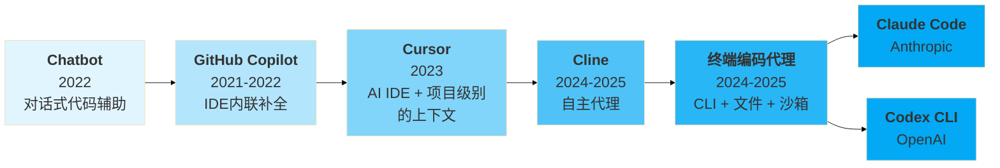

# 简介：编码代理发展脉络

- **Chatbot（你问我答）**：仅 Prompt/Response，对话里产出代码，需人工复制粘贴进工程。
- **GitHub Copilot（你一行我一行）**：IDE 内联补全，把"复制粘贴"缩短为"就地补齐"。
- **Cursor （你一行我一段）**：多行/乱序补全与任务式对话，引入 Composer 做跨文件改动。
- **Cline （你一句我做完）**：全代理化、以提示为中心、多文件编辑、命令执行。
- **Claude Code （万能乙方）**：接管 CLI 与文件编辑，接受复杂的需求，像乙方一样一次做完整个工程。
- **Codex CLI （金牌乙方）**：OpenAI 的对应方案，模型擅长算法理解，奥赛金牌选手。

 

