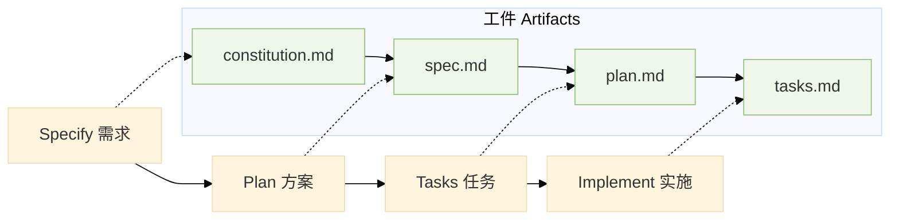
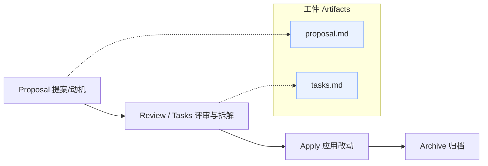

# 新范式 · 规范驱动的 AI 开发

从“写代码”转向“定义任务”的编程方式：先达成规范，再让 AI 写码。

### SpecKit（GitHub 开源）

- 先讲清楚“要做什么”，再让 AI 按清单写代码。
- 会产出 4 个文件：项目规则（constitution.md）、需求说明（spec.md）、实现方案（plan.md）、任务清单（tasks.md）。
- 常用命令：`/speckit.specify`、`/speckit.plan`、`/speckit.tasks`、`/speckit.implement`

 

---

# 新范式 · 规范驱动的 AI 开发
从“写代码”转向“定义任务”的编程方式：先达成规范，再让 AI 写码。

### OpenSpec（Fission‑AI）

- 先写一份“改动提案”，AI 和你对齐后再动手。
- 会产出 2 个核心文件：提案 `proposal.md`、任务清单 `tasks.md`。
- 你的操作：三条命令走完一件变更。

